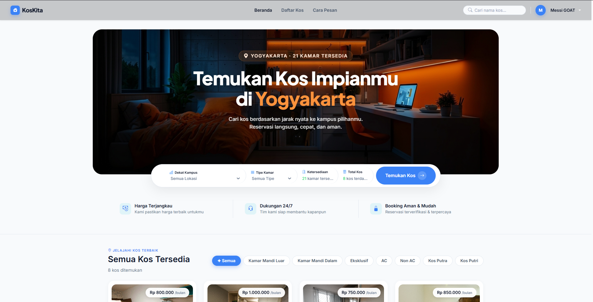
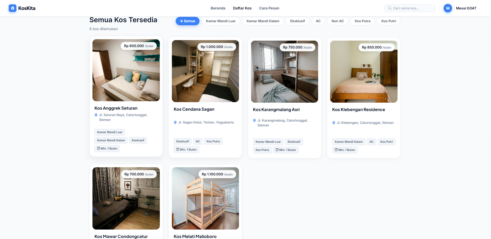
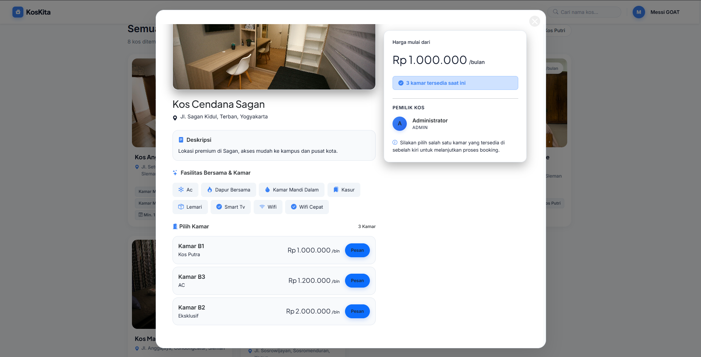
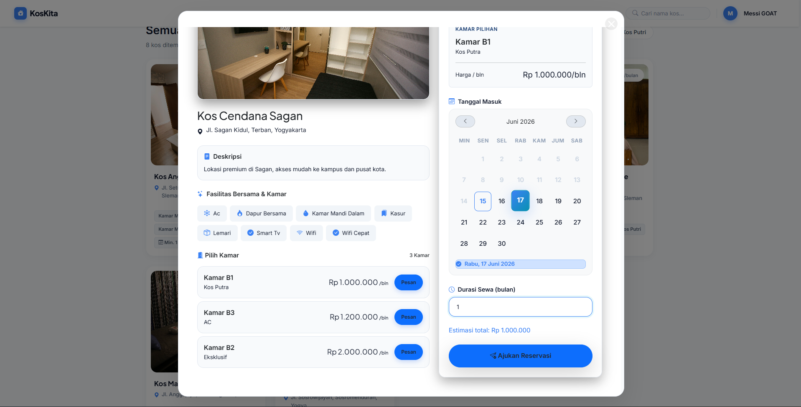
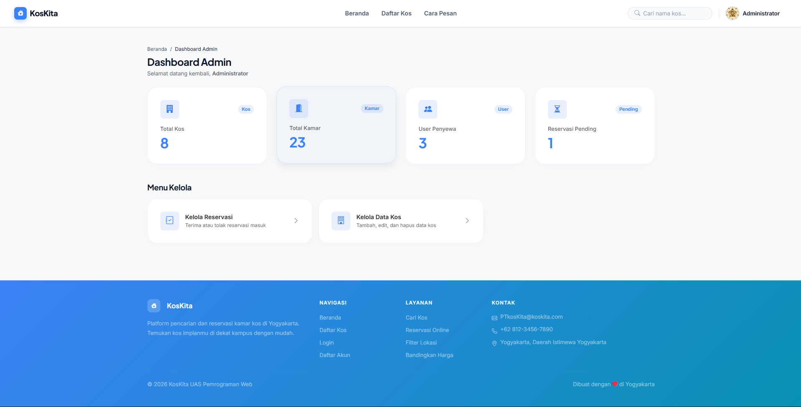
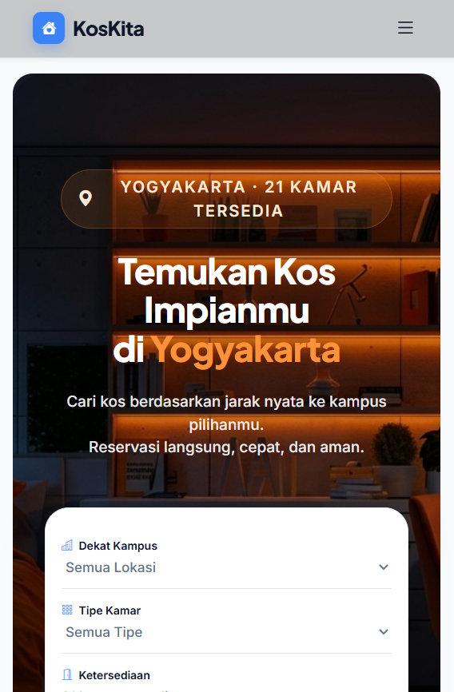

# KosKita - Web Reservasi Kos-Kosan Yogyakarta

> Web app PHP buat nyari dan booking kamar kos di Jogja.
> Project ini dibuat buat memenuhi tugas UAS matakuliah Praktikum Pemrograman Web 1.

---

## Biodata Pembuat

| Detail          |                                        |
| --------------- | -------------------------------------- |
| **Nama**        | Rafa Irhamniyansyah Achmad             |
| **NIM**         | 25/557712/SV/26222                     |
| **Prodi**       | Teknologi Rekayasa Perangkat Lunak     |
| **Mata Kuliah** | Praktikum Pemrograman Web 1            |
| **Dosen**       | Achmad Choirudin Emcha, S.Kom., M.Eng. |

---

## Tentang Project Ini

**KosKita** itu web reservasi kos-kosan biar pencari kos ga perlu muter-muter Jogja secara fisik buat nyari info. Di web ini ada 3 role:

- **Pencari Kos**: Bisa nyari kosan terdekat dari kampus pilihan (jaraknya dihitung real-time pake rumus Haversine), liat fasilitas lengkap, terus langsung booking secara online.
- **Pemilik Kos**: Bisa daftarin kos miliknya, ngelola info kamar (tambah/edit/hapus), dan nge-approve atau nolak bookingan dari penyewa.
- **Admin**: Bisa mantau dan ngelola semua data kos, kamar, dan transaksi reservasi lewat satu dashboard utama.

---

## Fitur-Fiturnya

### Halaman Publik (Tanpa Login / Penyewa)

- **Cari Kos Terdekat** - Filter lokasi kos berdasarkan area kampus terdekat (UGM, UNY, UPN, dll) lengkap dengan kalkulasi jarak asli via rumus Haversine.
- **Detail Kos Lengkap** - Ada foto kosan, fasilitas yang didapet, daftar kamar yang tersedia, sama info pemiliknya.
- **Reservasi Online** - Bisa langsung booking kamar lewat form reservasi yang udah divalidasi tanggal mulai kos sama durasinya.
- **Halaman Profil** - Buat ngedit data diri, ganti password, sama mantau status bookingan yang udah dipesen.

### Autentikasi & Keamanan

- Login & Register dibedain untuk 2 jalur: Pencari Kos dan Pemilik Kos.
- Password udah di-hash aman di database pake `password_hash()` + `password_verify()`.
- Autentikasi session-based biar session user ga gampang hilang atau ketuker.

### Dashboard (Khusus Admin & Pemilik Kos)

- Statistik ringsir di homepage dashboard (total kos, kamar, user terdaftar, sama bookingan pending).
- CRUD Properti Kos - Bisa tambah, edit, hapus kosan sekalian upload foto kos.
- CRUD Kamar - Manajemen tipe dan detail kamar per properti kos.
- Kelola Bookingan - Fitur buat nerima (approve) atau menolak reservasi yang masuk.

---

## Tech Stack yang Dipake

| Teknologi         | Keterangan / Kegunaan                                           |
| ----------------- | --------------------------------------------------------------- |
| PHP 8.x           | Backend & handling logic di sisi server                         |
| MySQL / MariaDB   | Database buat nyimpen data project                              |
| Bootstrap 5.3     | Biar layout web rapi, responsif, & ga pusing bikin CSS dari nol |
| jQuery 3.7        | Buat nambahin interaksi frontend & handles request AJAX         |
| Bootstrap Icons   | Library icon biar tampilan navigasi dan tombol makin cakep      |
| Plus Jakarta Sans | Font utama biar keliatan modern (Google Fonts)                  |
| XAMPP             | Local server package (Apache & MySQL)                           |

---

## Struktur Tabel Database

```
koskita/ (Nama Database)
├── user          - nyimpen data pengguna (penyewa, pemilik kos, dan admin)
├── area          - daftar kampus acuan + koordinat GPS-nya
├── tipe_kamar    - jenis kamar (misal: AC, Non AC, Eksklusif)
├── kos           - data kos-kosan + koordinat lokasinya
├── kamar         - detail dan stok kamar di tiap kos
└── reservasi     - data transaksi booking dari penyewa
```

---

## Struktur Folder Project

```
koskita/
├── admin/              # Halaman dashboard khusus admin & pemilik kos
│   ├── dashboard.php
│   ├── kos_form.php
│   ├── kos_list.php
│   ├── kamar_list.php
│   └── reservasi_list.php
├── assets/
│   ├── css/style.css   # Custom stylesheet (pake tema gelap/dark theme)
│   ├── js/script.js    # Logic JS frontend & handles jQuery
│   └── img/            # Folder upload foto kos & foto profil user
├── auth/
│   ├── login.php
│   ├── register.php
│   └── logout.php
├── config/
│   └── db.php          # File koneksi ke MySQL (sengaja di-exclude dari git)
├── includes/
│   ├── header.php      # Layout bagian atas (navbar & stylesheet)
│   └── footer.php      # Layout bagian bawah (footer & script JS)
├── index.php           # Halaman beranda utama
├── detail_kos.php      # Detail kos lengkap + daftar kamar
├── reservasi.php       # Halaman form booking & riwayat booking
├── profil.php          # Edit profil & ganti password
├── database.sql        # File export database buat di-import ke phpMyAdmin
├── .gitignore
└── README.md
```

---

## Cara Menjalankan Project

### Persiapan

- XAMPP (Apache & MySQL) udah terinstall.
- Pake browser apa aja (Chrome, Firefox, Edge, dll).

### Langkah Setup

**1. Clone Repository**
Tinggal clone repo ini lewat terminal atau git bash:

```bash
git clone https://github.com/rafa1606/koskita.git
```

**2. Pindahin ke Folder htdocs**
Copy folder `koskita` ke direktori htdocs XAMPP:

```
C:\xampp\htdocs\koskita\
```

**3. Import Database**

- Buka `http://localhost/phpmyadmin` di browser.
- Buat database baru bernama `koskita`.
- Masuk ke menu **Import** di bagian atas, pilih file `database.sql` di folder project, terus klik tombol **Import** (atau **Go**).

**4. Buat File Konfigurasi Database**
Karena file koneksi database di-ignore biar ga bocor ke GitHub, buat file `config/db.php` secara manual. Kodenya kayak gini:

```php
<?php
define('DB_HOST', 'localhost');
define('DB_USER', 'root');
define('DB_PASS', '');
define('DB_NAME', 'koskita');
define('BASE_URL', 'http://localhost/koskita');

if (session_status() === PHP_SESSION_NONE) session_start();

$conn = mysqli_connect(DB_HOST, DB_USER, DB_PASS, DB_NAME);
if (!$conn) die('Koneksi gagal: ' . mysqli_connect_error());
mysqli_set_charset($conn, 'utf8mb4');
```

**5. Start Server di XAMPP**

- Buka XAMPP Control Panel.
- Klik **Start** pada Apache dan MySQL.

**6. Buka Web di Browser**
Tinggal akses url ini di browser:

```
http://localhost/koskita
```

---

## Akun Uji Coba (Biar Praktis)

| Role / Akses          | Email             | Password |
| --------------------- | ----------------- | -------- |
| Admin / Owner         | admin@koskita.com | admin123 |
| Penyewa (Pencari Kos) | budi@gmail.com    | user123  |

---

## Tampilan / Screenshot Web

### Halaman Beranda / Landing Page



### Halaman Daftar Properti Kos



### Detail Lengkap Properti



### Form Reservasi Kamar



### Dashboard Utama Admin & Owner



### Tampilan Responsif (Mobile)



---

## Checklist Fitur UAS (Spesifikasi Teknis)

### Tampilan & Bootstrap

- [✅] Udah pake sistem grid Bootstrap (`col-*`, `container`, `row`) biar rapi.
- [✅] Navbar responsif (bisa nge-collapse pas dibuka di HP/mobile).
- [✅] Pake komponen Bootstrap: Card, Badge, Alert, Button, Breadcrumb.
- [✅] Tampilan responsif aman terkendali dari resolusi 375px sampai 1440px.

### JavaScript & Interaksi Frontend

- [✅] Validasi form di frontend sebelum data dikirim (minimal ada 2 field yang divalidasi).
- [✅] Konfirmasi hapus data pake modal/pop-up `confirm()` biar user ga salah hapus.
- [✅] Manipulasi DOM (tampil pesan error inline, toggle visibility password/elemen).
- [✅] Pake `addEventListener` di beberapa script JS buat nanganin event klik/submit.

### PHP & Keamanan

- [✅] Semua data inputan dari user dilewatin ke `htmlspecialchars()` pas mau di-output biar aman dari serangan XSS.
- [✅] Pendaftaran password pake `password_hash()` dan pas login divalidasi pake `password_verify()`.
- [✅] Pake `session_start()` buat ngurusin hak akses login user.
- [✅] File konfigurasi database dipisah ke file tersendiri (`config/db.php`).
- [✅] Bersih dari hardcoded credentials di file script utama.

### Database & CRUD

- [✅] **CREATE**: Form tambah kosan & kamar baru tersimpan aman ke database MySQL.
- [✅] **READ**: Nampilin data kosan, kamar, dan riwayat pesanan dinamis dari DB.
- [✅] **UPDATE**: Form edit kosan & kamar berfungsi buat nge-update data lama di DB.
- [✅] **DELETE**: Bisa hapus data kosan dan data kamar.
- [✅] Pake prepared statement (`mysqli_prepare`) di query-query penting biar aman dari SQL Injection.

### Halaman Daftar Data

- [✅] Pagination di halaman daftar kos (6 kos per halaman).
- [✅] Fitur search kos berdasarkan nama dan alamat.

## Fitur Unggulan

**Perhitungan Jarak Haversine** - Web ini bisa ngitung jarak lurus (dalam km) secara real-time dari koordinat GPS properti kosan ke titik koordinat kampus terdekat yang dipilih. Ini query SQL yang dipake di dalam backend:

```sql
(6371 * ACOS(
    COS(RADIANS(lat_area)) * COS(RADIANS(k.latitude)) *
    COS(RADIANS(k.longitude) - RADIANS(lng_area)) +
    SIN(RADIANS(lat_area)) * SIN(RADIANS(k.latitude))
)) AS jarak_km
```

---

_UAS Praktikum Pemrograman Web 1_
